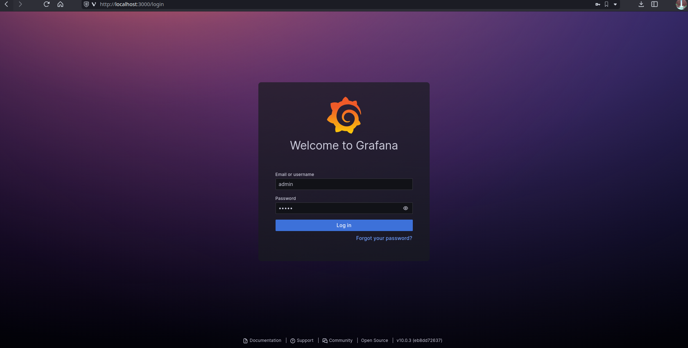
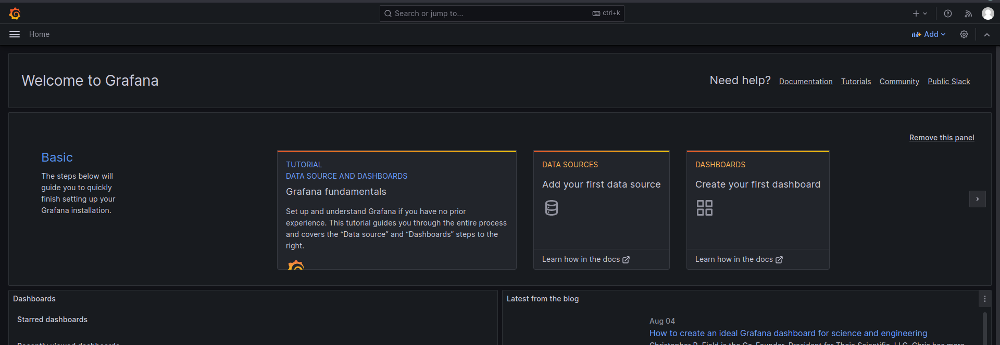
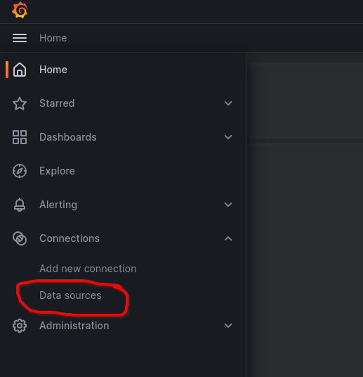
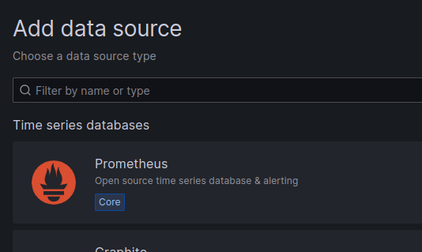
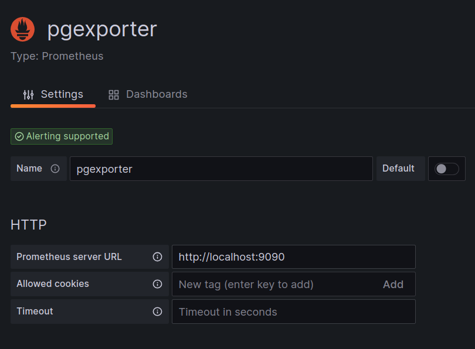
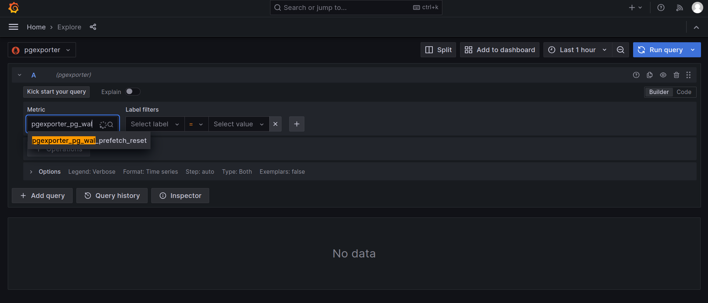
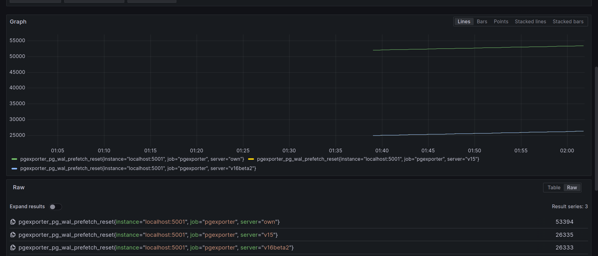

# Grafana Dashboard

This tutorial will show you how to encapsulate Prometheus standard API and use them to monitor state of pgexporter with the help of Grafana dashboard.

## Preface

This tutorial assumes that you have an installation of PostgreSQL 12+ and pgexporter.

See [Install pgexporter](https://github.com/pgexporter/pgexporter/blob/main/doc/tutorial/01_install.md)
for more detail.

## Prometheus Configuration

### Installation
First of all, you should install Prometheus in your pgexporter server. Download one of the binaries from the [Prometheus Downloads](https://prometheus.io/download/), say `prometheus-2.45.0.linux-amd64.tar.gz` (may be different for you, but the following instructions are based off of this).

Unzip the tarball:
```sh
$ tar -xzvf prometheus-2.45.0.linux-amd64.tar.gz
```

(OPTIONAL) Putting the binaries in a location included in `PATH` so that it's convenient to use `$ prometheus` (choosing `/usr/local/bin` for this):
```sh
$ sudo mv prometheus-2.45.0.linux-amd64/prometheus /usr/local/bin
$ sudo mv prometheus-2.45.0.linux-amd64/promtool /usr/local/bin
```

Verify:
```sh
$ prometheus --version
prometheus, version 2.45.0 (branch: HEAD, revision: 8ef767e396bf8445f009f945b0162fd71827f445)
  build user:       root@920118f645b7
  build date:       20230623-15:09:49
  go version:       go1.20.5
  platform:         linux/amd64
  tags:             netgo,builtinassets,stringlabels
```

### Configuration
After you successfully installed Prometheus, you should replace `prometheus.yml` with the content below to configure how to query your pgexporter metrics (assuming `pgexporter` runs on port `5002` on `localhost`):
```yml
scrape_configs:
  - job_name: 'pgexporter'
    metrics_path: '/metrics'
    static_configs:
      - targets: ['localhost:5002']
```

Run Prometheus using:
```sh
$ prometheus
```
(assuming there is a valid `./prometheus.yaml`).


Then the Prometheus service will query your pgexporter metrics every 15 seconds and package them as time-series data. You can query your pgexporter metrics and watch their changes as time passed in Prometheus web page (default port is `9090`).


## Grafana Dashboard

Although Prometheus provides capacity of querying and monitoring metrics, we can not customize graphs for each metric and provide a unified view. As a result, we use Grafana to help us manage all graphs together.

### Installation
First of all, we should install Grafana in the computer you need to monitor pgexporter metrics. Installation instructions for your preferred operating system is provided in the official [Grafana Installation page](https://grafana.com/docs/grafana/latest/setup-grafana/installation/):

For example, on Fedora it is:
```sh
$ wget -q -O gpg.key https://rpm.grafana.com/gpg.key
$ sudo rpm --import gpg.key
```

Create and edit file `grafana.repo`:
```sh
$ sudo nano /etc/yum.repos.d/grafana.repo
```
Contents of the file:
```
[grafana]
name=grafana
baseurl=https://rpm.grafana.com
repo_gpgcheck=1
enabled=1
gpgcheck=1
gpgkey=https://rpm.grafana.com/gpg.key
sslverify=1
sslcacert=/etc/pki/tls/certs/ca-bundle.crt
```
Save and Exit.

```sh
$ sudo dnf install grafana
```

Start the daemon:
```sh
$ sudo systemctl start grafana-server
$ sudo systemctl status grafana-server
```
Verify the status is "active (running)".

### Configuration
You can now browse Grafana web page with default port `3000`, default user `admin` and default password `admin`.

Set the new password.



Then you can create Prometheus data source of pgexporter. Click Menu -> Connections -> Data Sources -> "Add data source" -> Prometheus.





Then configure the data source and then "Save & test":



Then you can explore dashboards with queries in "Expore" (Home -> Explore):


Then "Run Query":


